#行为树
>行为树（BT）是计算机科学，机器人，控制系统和视频游戏中按计划执行的数学模型。 用模块化的方式描述了一组有限的任务之间的切换。 它的优势来自创建由简单任务组成的非常复杂的任务的能力。 BT与分层状态机呈现出一些相似之处，主要区别在于行为的主要构件是任务而不是状态。 —— Wikipedia

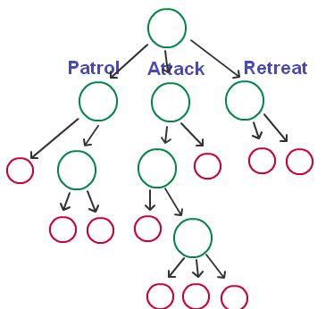

行为树的一般特点有
  * 自顶向下的树，通过一些条件来搜索这颗树，最终确定需要做的行为，并且执行它
  * 主要包含 **行为结点** **控制结点** **前提** 三大类
  * 在每帧都会重新评估整棵树

###行为结点（Action Node）
  * 叶子上的节点，一般称之为行为节点,如上图红圈表示的，一般分为两种运行状态：
    * 运行中（Executing）：该行为还在处理中
    * 完成（Completed）：该行为处理完成，成功或者失败

###控制结点（Control Node）
  * 非叶子上的结点,一般称之为控制节点如上图绿圈表示的，
  * 控制节点是与游戏无关的，因为他只负责行为树逻辑的控制，而不牵涉到任何的游戏代码。
  * 一般有三种运行状态：
    * 选择（Selector）：选择其子节点的某一个执行
    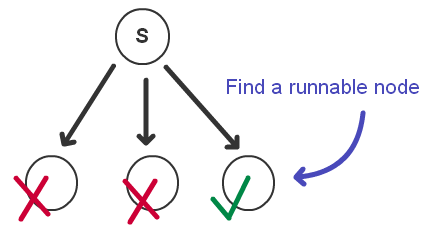
    * 序列（Sequence）：将其所有子节点依次执行，也就是说当前一个返回“完成”状态后，再运行先一个子节点
    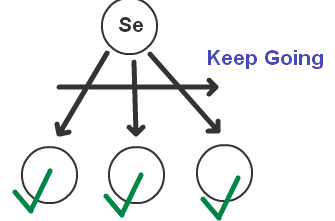
    * 并行（Parallel）：将其所有子节点都运行一遍
	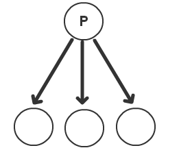

###前提（Precondition）
  * 前提就提供了“选择”的依据，它包含了进入，或者说选择这个节点的条件，如下图

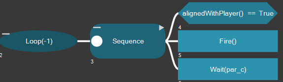

##UE4行为树（Behavior Tree）
>行为树是虚幻引擎 4 中创建 AI 的强大工具。它们是两种资源的组合：黑板（Blackboard） 和 行为树（Behavior Tree）。

  * 黑板：黑板是 AI 的数据存储器。通过key-value形式保存数据，以供行为树使用。(数据)
  * 行为树：行为树是 AI 的处理器。它做出决策，然后执行决策。(逻辑处理)

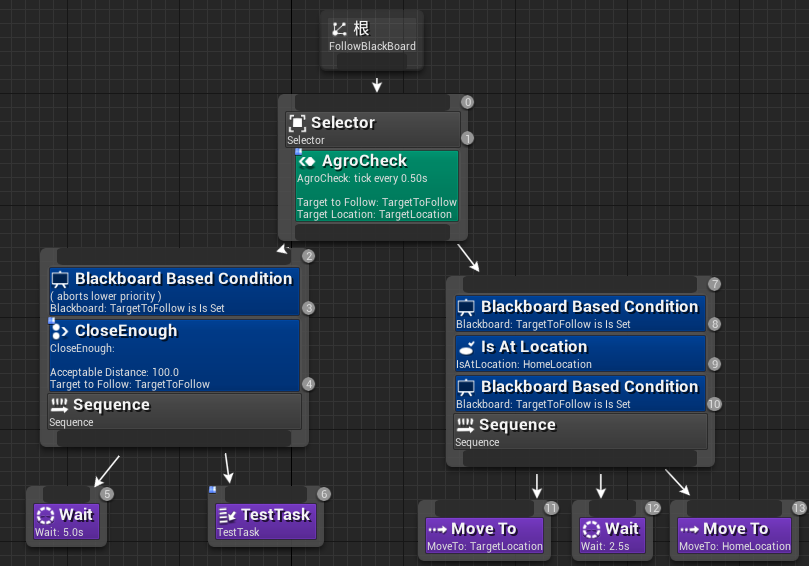

###黑板（Blackboard）
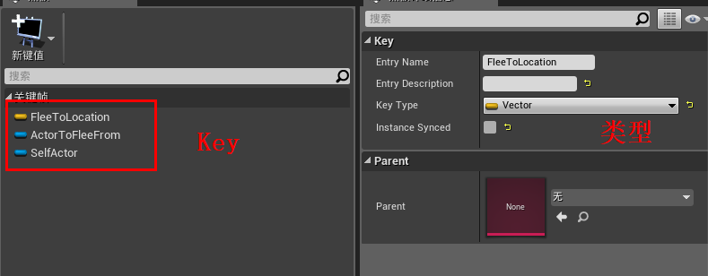

###行为树
UE4行为树中提供了很多默认的结点,常用的主要有以下几种
  * **Root**： 它是行为树的根节点。
  * **Composite**：定义一个分支的根以及该分支如何被执行的基本规则
  * **Task**：这种节点是行为树的叶子，实际“执行”操作，不含输出连接。
  * **Decorator**：即为条件语句。这种节点附着于其他节点，决定着树中的一个分支，甚至单个节点是否能被执行。
  * **Services**：这种节点附着在 Composite 节点上，只要其分支节点被执行，它们便将按所定义的频率执行。它们常用于检查和更新黑板。它们以行为树系统的形态取代了传统平行节点。

####Root
Root结点有以下几个特点
  * 无法被 **Decorators** 或 **Services** 附着
  * 可设置行为树的黑板资源。
  * 它只拥有一个连接.

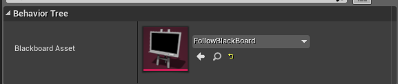

####Composite
>Composite 节点 定义一个分支的根以及该分支如何被执行的基本规则。可在其上应用 Decorators 节点，以便修改分支的条目，甚至可在执行过程中取消。此外还可使 Services 节点附着在它们上，Composite 节点的子项被执行时才会将其启用。

Composite结点包含三个子项
  * Selector：从左至右执行其子项，其中一个子项达成后将停止执行其子项。如 Selector 的子项达成，则 Selector 也达成。如 Selector 的所有子项未达成，则 Selector 未达成。
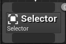
  * Sequence： 从左至右执行其子项，如其中一个子项未达成，将停止执行执行其子项。如子项未达成，则 Sequence 也未达成。如 Sequence 的所有子项均达成，则 Sequence 也达成。
  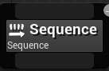
  * Simple Parallel：使单个主任务节点在行为树旁执行。
    * 只允许两个子结点：一个为任务节点（可含 decorators）、另一个为 background tree (分支树)。
    * 主任务完成后，Finish Mode 中的设置将确定节点马上终止 background tree ，或是否延迟到 background tree 完成。
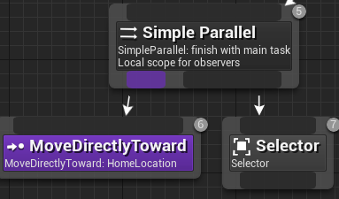

####Task
>Task 是真正“执行”操作的节点，如移动 AI，或调整黑板值。它们可以被 Decorators 附着。

UE4主要给出了主要包含以下几个子项
  * Move To：将使带 Character Movement 组件的 Pawn 利用 NavMesh 移动到BlackboardKey(一个代表移动位置的属性)
  * Play Sound：播放 Sound to Play 属性中指定的声音。
  * Run Behavior：用于运行另一个行为树。
  * Run EQS Query：运行EQS结点
  * Wait：行为树的执行将在此节点上等候，直到等候时间结束。
  * Wait Blackboard Time：与 Wait Task 节点原理相似，唯一的不同点是它会获取Blackboard的某个属性为等待时间。
  * Play Animation：用于播放Pawn的动作

 

除了默认给出的Task之外,UE4还允许通过继承蓝图类 **BTTask_BlueprintBase** 来自定义Task。

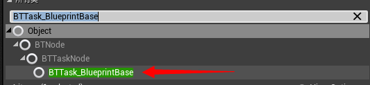

####Decorator
>条件判断语句，附着于一个 Composite 或 Task 节点，并决定树中的一个分支或单个节点是否可被执行。

UE4主要给出了默认以下几个子项

  * Blackboard：检查 Blackboard 中的指定 Blackboard Key 上是否已设置数值。
  * Compare Blackboard Entries：对比两个　Blackboard Key　的数值，基于对比结果（相等或不等）阻止或允许节点的执行。
  * Conditional Loop：只要满足 Blackboard 中的指定 Blackboard Key 为True,则一直循环下去
  * Cone Check：有 3 个矢量键：第一个确定开始锥体的的位置，第二个定义锥体朝向的方向，第三个用于确定位置是否在锥体内。通过 Cone Half Angle 属性可对锥体角度进行定义。
  * Cooldown：锁定一个节点或分支的执行，直到冷却时间结束。
  * Does Path Exist：确定路径是否可由以下两个矢量组成：Blackboard Key A 和 Blackboard Key B。
  * Force Success：强制结点执行成功
  * Loop：以一定次数或无限循环节点或分支。
  * Reached Move Goal：节点将检查 Pawn（带一个 Character Movement 组件）的路径并在 Pawn 到达其移动目标后返回成功。

同样的,除了默认的**Decorator**之外,UE4还允许通过继承蓝图类 **BTDecorator_BlueprintBase** 来自定义**Decorator**
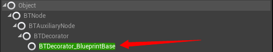

例子中蓝色的两个蓝色的条目都为**Decorator**
  * Blackboard Based Condition 是检测 **黑板(BlackBorad)** 中某个值是否为None来进行条件判断
  * 第二个是自定义的**Decorator**,检测是否足够接近

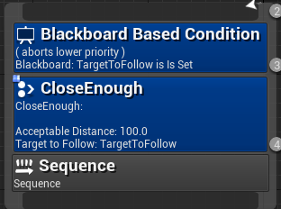

####Services
>附着在 Composite 节点上，只要其分支节点被执行，它们便将按所定义的频率执行。它们常用于检查和更新黑板。它们取代了传统行为树的平行节点。

例子中蓝色的两个吕色的条目都为**Services**
  * 每0.5秒执行一次
  * **TargetToFollow**和**TargetLoation**表示该**Services**中会检测和更新这两个黑板的属性
  * **Services**都需要自定义
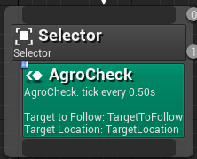

###与标准行为树的不同
UE4 行为树的优点：
  * 清晰明了:使用 Services 和 Simple Parallel 节点可创建出易于理解的简单行为树。
  * 便于纠错:图表更清晰，便于纠错。除此之外，更少的同时执行路径十分便于观察图表中实际发生的状况。
  * 优化简单:如没有较多同时执行的分支树，事件驱动型图表将更易于优化。

####1.UE4 行为树为事件驱动型
  * 避免在每帧中执行大量工作。只会被动地等待在树中引起变化的“事件”。
  * 运行性能和除错大有帮助。
  * 整个树的每个标记中无需迭代，因此运行性能将大大提升！从概念上而言，我们不需要不停地问“我们到了吗”，只需要轻松休息，会有人来告诉我们“到啦！”

####2.条件语句并非叶节点
  * 使用Decorator系统替代条件语句
  *  decorators 使行为树 UI 显得更加直观易读。条件语句位于其所控制分支树的根部，因此一旦条件语句未被满足，便可直接看到树的哪个部分被“关闭”
  *  所有叶节点均为行动 tasks，因此更容易分辨树在对哪些实际行动下达命令。

####3.并发行为的特殊处理（parallel）
标准行为树通常使用 Parallel composite 节点来处理并发行为。Parallel 节点同时执行其所有子项。

UE4 行为树抛弃了复杂 Parallel 节点，用以下几个方面来实现相同的功能
  * Simple Parallel ：只允许两个子结点：一个为任务节点（可含 decorators）、另一个为分支树。
  * Services：composite 节点（Selector、Sequence、或 Simple Parallel）相关的特殊节点。它能在每 X 秒注册回调并执行多个定期发生类型的更新。
  * Decorator “Observer Aborts” 属性：条件 decorators 将观察数值，并在需要时中止任务
    * **None**：Do not abort anything.
    * **Self**：Abort self, and any sub-trees running under this node.
    * **Lower Prority**：Abort any nodes to the right of this node.
    * **Both**：Abort self, any sub-trees running under me, and any nodes to the right of this node.